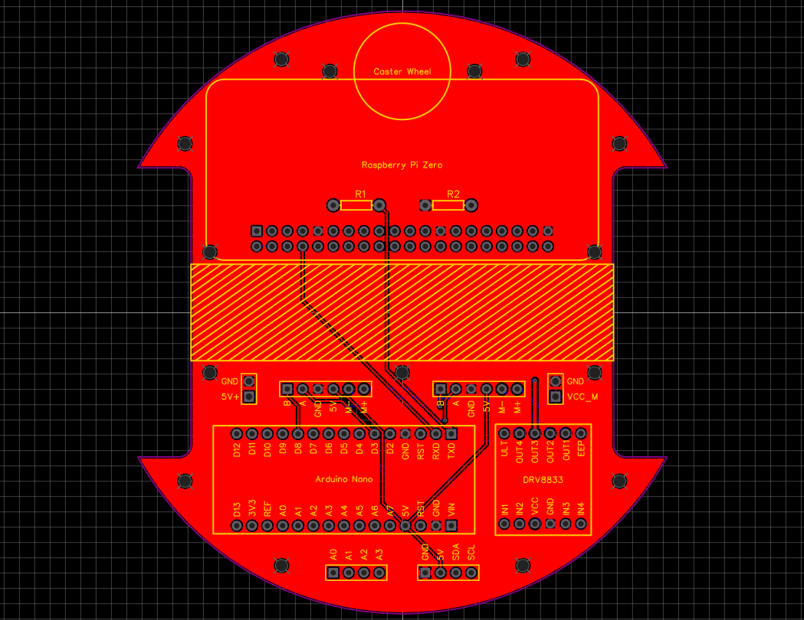
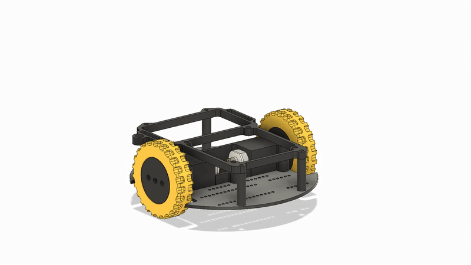

# Differential Drive – Hardware

This repository contains the Gerber files, Bill of Materials and STL/3MF files for my Differential Drive robot.

Take also a look to the [repository containing the Controller](https://github.com/ggldnl/Differential-Drive-Controller.git).
I documented the design process, construction and theory in [this article](https://ggldnl.github.io/projects/differential_drive/index.html).

## PCB and Electronics

  
  

 

Summary of the main components and their function:

| Component                          | Description                                                                                           |
| ---------------------------------- | ----------------------------------------------------------------------------------------------------- |
| Raspberry Pi Pico                  | Main processing unit. Can act as a high-level node in a larger system, receiving messages from external processes and sending commands to the Arduino.|
| Arduino Nano                       | Near-real time processing unit managing motor control, sensors, communication, ...                    |
| DRV8833 Dual H-Bridge              | Controls the direction and speed of two DC motors using PWM signals.                                  |
| N20 Geared DC Motors (60RPM)       | Provide locomotion for the differential drive; each of them has a magnetic encoder.                   |
| I2C Interfacing connector          | Connector to interface with I2C devices.                                                              |
| Analog A0-A3 pins connector        | Reserved for future expansion; provides access to pins A0-A3; can be used to read analog sensors or control inputs. |

## Mechanical Design

  

 

The mechanical assembly consists of 3D-printed structural parts and a small set of standard hardware components. The PCB is directly used as chassis to provide a rigid base where to mount the 3d printed parts.

All the parts are printed in PLA except for the tires that are printed in TPU.

## Complete BIll of Materials

| Component      | Quantity | Notes      |
|----------------|----------|------------|
| Raspberry pi pico | 1 | |
| Arduino Nano | 1 | |
| DRV8833 | 1 | |
| N20 Geared DC Motor (60RPM) | 2 | You can find multiple versions of these motors that looks very similar to each other; the only things that changes is the gear ratio and thus the max RPM |
| Battery | 1 | I used a 2S 500mAh Lipo battery; similar ones are commonly found in RC planes and cars. You can use different batteries, the regulator should support 2-6S Lipo (7-25.5V). |
| ZMR 8A Dual BEC | 1 | Difficult to find documentation about it, you can use something else. |
| 2x20 Female headers | 1 | To mount the Raspberry |
| 1x15 Female headers | 2 | To mount the Arduino | 
| 1x6 Female headers  | 2 | To mount the DRV8833 |
| 1x4 JST-XH Female connector | 2 | For the two expansion set of pins |
| Metal ball with a 10mm diameter | 1 | Caster wheel |
| M2 Heat set inserts | 21 | |
| M2 6mm screw | 21 | |
| On/off Switch | 1 | The 3d printed mount is compatible with a DPDT Mini Toggle Switch | 

## 🤝 Contribution
Feel free to contribute by opening issues or submitting pull requests. For further information, check out the [main Hexapod repository](https://github.com/ggldnl/Differential-Drive). Give a ⭐️ to this project if you liked the content.
